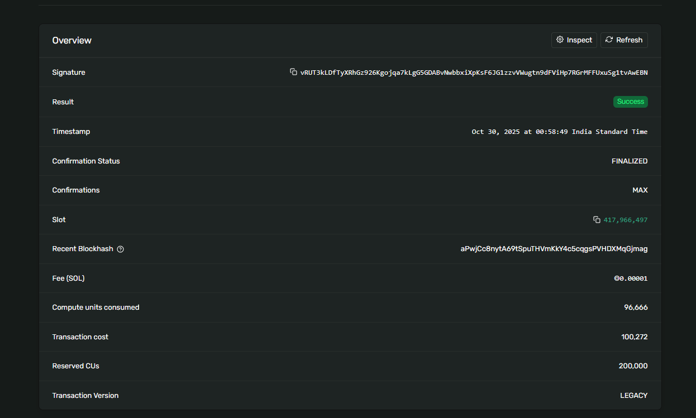
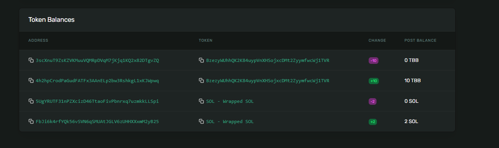

# Escrow

An escrow contract that allows users trade SPL Tokens in a trustless manner.

## User Story & Architecture Diagram

[Click Here](https://docs.google.com/document/d/1dEAGeWgn_7CvGvKf4V9BPOfmLPmn5RBmIvRq2dRwhMA/edit?usp=sharing) for user story

## Functionality

- **CreateOffer**: Allows user to initalize a token trade by offering to swap between two tokens on a set amount.
- **Refund**: User close the offer without executing a trade and the tokens will be returned back to the user
- **TakeOffer**: Some other party(Taker) can agree to the proposed offer then can swap between the offered token amount,

## Completed Escow Token Trade




[Click Here](https://explorer.solana.com/tx/vRUT3kLDfTyXRhGz926Kgojqa7kLgG5GDABvNwbbxiXpKsF6JG1zzvVWugtn9dFViHp7RGrMFFUxuSg1tvAwEBN?cluster=devnet) to visit in solana explorer

- **TokenA**: BzezyWUhhQK2K84uypVnXHSojxcDMt2ZyymfwcWj1TVR
- **TokenB**: So11111111111111111111111111111111111111112

- **Escrow Initialization Sigature**: 3G9msVo9z2cbMdd6FEpPCmeB77Wy1S8zX1KJwy8vD3pR3seVXNcytiBQ2UL5uA772ADnzDYsbZwAWXoxwHKbLMuQ
- **Escrow Completion Signature**: vRUT3kLDfTyXRhGz926Kgojqa7kLgG5GDABvNwbbxiXpKsF6JG1zzvVWugtn9dFViHp7RGrMFFUxuSg1tvAwEBN

## Installation & Build

```bash
npm install

anchor build
```

## Tests
```
anchor test
```

## Deployment

Inside Anchor.toml replace `[programs.localnet]` to `[programs.devnet]` and replace `cluster = "localnet"` under `[provider]` to `cluster = "devnet"`

```bash
solana config set --url devnet
anchor deploy
```
